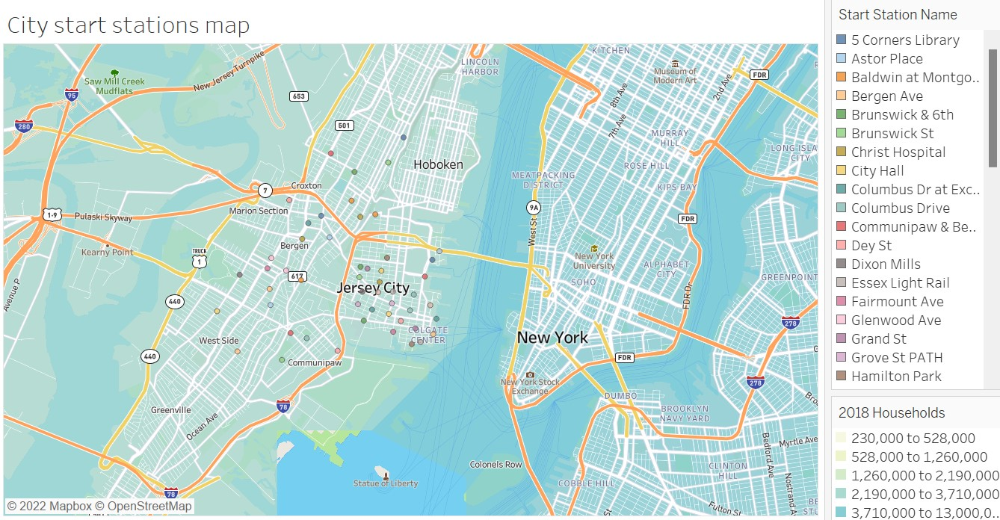
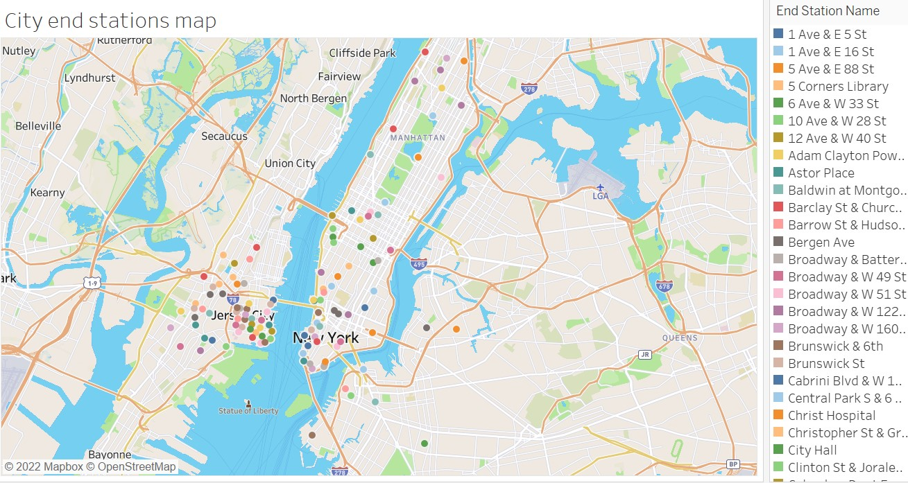
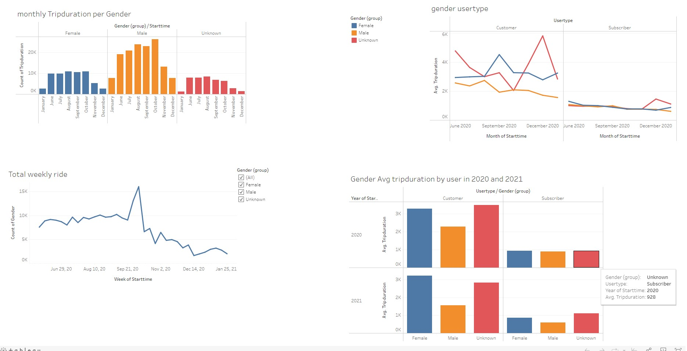
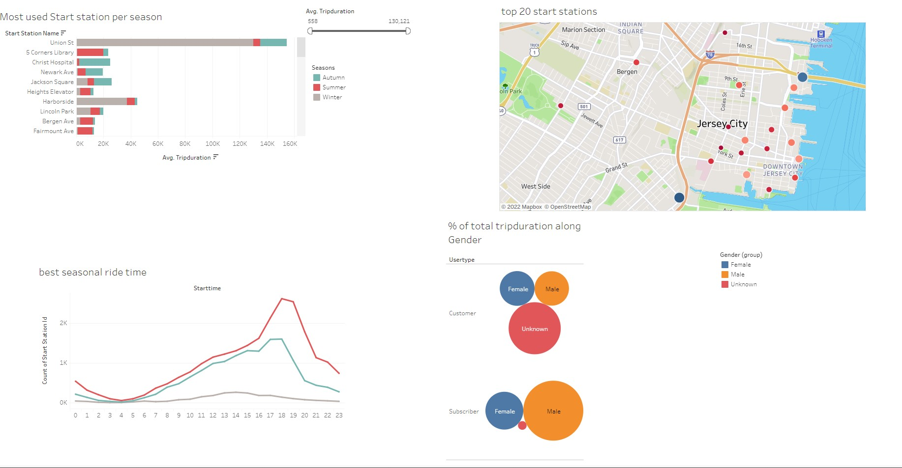

# Visualizations, Dashboards and Story
Click the link below to access the public tableau
https://public.tableau.com/app/profile/kouam.kouassi/viz/KouamKouassi/SeasonalTripdashboard?publish=yes

## Background

Congratulations on your new job! As the new lead analyst for the [New York Citi Bike](https://en.wikipedia.org/wiki/Citi_Bike) Program, you are now responsible for overseeing the largest bike-sharing program in the United States. In your new role, you will be expected to generate regular reports for city officials looking to publicize and improve the city program.

# Data
Since 2013, the Citi Bike Program has implemented a robust infrastructure for collecting data on the program's utilization. Each month, bike data is collected, organized, and made public on the [Citi Bike Data](https://www.citibikenyc.com/system-data) webpage.

For this min project, i used the Citi Bike data from June 2020 to January 2021. 

## What you can find in my Citi Bike public tableau

I created 13 visualizations, 2 dashboards and a story. With the data from Citi Bike I found some interesting fenomenon that will be displayed and analysed in this presentation.

#### Visualizations

* City Start stations Map Which map all bike stations available in the dataset.

* City End stations Map Which map all end bike stations available in the dataset.

*  Total weekly ride 

* Gender average tripduration by user in 2020 and in 2021

* Monthly Tripduration per Gender

* Gender usertype per month

* Usertype Weekly average tripduration  per Gender

* Birth year of riders by gender

* Top 20 start stations 

* Top 20 end stations

* % of total tripduration along Gender

* Best seasonal ride time

* Most used Start station per season

# Tableau page details

### This Map represents the City start stations
The stations are all located in Jersey City

### This Map represents the City end stations
In this visualization, it can be seen that the stations are distributed in Jersey City and New York

# Dashboards
### Dashboard 1 : an dynamic dashboard that put in relation the gender group, the usertype and the duration of the trip.

1. The dashboard is made by 4 visualizations:
  * <b> The monthly trip duration per Gender </b> shows the count of trip duration made by the three gender groups ( Female, Male and Unknown), from which it is possible to notice that the male group had made more trips every month.
  * <b> Gender user type </b> represents the user type regardless of whether it is from any gender group. The Customer and the Subscriber describe the type of user. The former is a user with a 24-hour or 3-day subscription, and the latter has an annual subscription.
This visualization tells us that after a drastic decrease from June 2020 to October 2020, the unknown client has seen its average Trip duration significantly increase from the previous low of 2041 to a value of 5809 in December 2020 and then drop dramatically. The highest value of the average Tripduration for women was observed in September 2020, while male values are shallow. 
  * <b> Total weekly ride </b> represents the total number of rider in evry week from June 2020 to January 2021.
  * <b> Gender Avg trip duration by user in 2020 and 2021 </b> shows the gender riders of the two user types in 2020 and 2021. The bar graph of the customer in the year 2020 highlights the fact that the unknown and the female have almost the same average trip duration. However, The unknown has a higher average trip duration, followed by the female, while the male has the lowest value. The difference is minimal when considering the subscriber in the same year. 
In 2021, even though the male customer average trip duration is still the lowest, the female had overtaken the unknown. However, The subscriber bar graph of the same year shows that the unknown has a higher average trip duration.
In both years, however, the customer has significantly used the service offered by Citi Bike, as highlighted by the graph.

### Dashboard 2 : The Seasonal Trip dashboard is a dynamic visualization showing the interaction between the four views it is made up of.

Remember, the people reading your analysis will NOT be data analysts. Your audience will be city officials, public administrators, and heads of New York City municipal departments. Your data and analysis need to be presented in a way that is focused, concise, easy to understand, and visually compelling. Your visualizations should be colorful enough to be included in press releases, and your analysis should be thoughtful enough to inform programmatic changes. 

## Submission 

Your final submission should include:

* A link to your Tableau Public workbook that includes the following:
  * 4–10 total "phenomenon" visualizations 
  * 2 dashboards
  * 1 city official map
  * 1 story 
  * A text or markdown file with your analysis of the phenomena you uncovered in the data.

## Sharing Your Work

To share your work, we are asking that you save your workbook as a `.twb`x file so your TAs can grade them.

To save your workbook as a .twbx file, select "Save As..." from the "File" drop-down. Then, select the .twbx option.

## Assessment

Your final product will be assessed on the following metrics:

* Analytic Rigor

* Readability

* Visual Appeal

## Hints

* You may need to get creative with how you combine each of the CSV files. Don't just assume Tableau is the right tool for the job. At this point, you have a wealth of technical skills and research abilities. Dig for an approach that works, and go with it.

* Don't assume that the CSV format hasn't changed since 2013. Subtle changes to the formats in any of your columns can interfere with your analysis. Ensure that your data is consistent and clean throughout your analysis. (Hint: Start and End Time change at some point in the history logs).

* Consider building your visualizations with small extracts of the data (like single files) before attempting to import the whole thing. What you will find is that importing all 20+ million records of data will create performance issues quickly. Welcome to "Big Data."

* While utilizing all of the data may seem like a nice power play, consider the time course in making your analysis. Is data from 2013 the most relevant for making bike replacement decisions today? Probably not. Don't let overwhelming data fool you. Ground your analysis in common sense.

* Remember, data alone doesn't answer anything. You will need to accompany your data visualizations with clear and directed answers and analysis.

* As is often the case, your clients are asking for a LOT of answers. Be considerate about their “need to know” and the importance of not "cramming in everything.” Of course, answer each question, but do so in a way that is organized and presentable.

* Since this is a project for the city, spend the appropriate time thinking through decisions on color schemes, fonts, and visual storytelling. The Citi Bike program has a clear visual style. As a suggestion, look for ways to have your data visualizations match their aesthetic.

* Pay attention to labels. What exactly is "time duration?” What's the value of "age of birth?” You will almost certainly need calculated fields to get what you need.

* Look for obvious outliers or false data. Not everyone who signs up for the program is answering honestly.

* In answering the question of "why" a phenomenon is occurring, consider adding other pieces of information, like socioeconomic or geographic data. Tableau has a map "layer" feature that you may find helpful.

* Don't be afraid to manipulate your data and play with settings in Tableau. Tableau is meant to be explored. We haven't covered everything that you’ll need &mdash; so keep an eye out for new tricks!

* Treat this as a serious endeavor! This is an opportunity to show future employers that you have what it takes to be a top-notch analyst. 

## Rubric

[Unit 18 Homework Rubric](https://docs.google.com/document/d/11hlhJnKmEJgRYL3mUxRcdrz4AIxBU5PXW5fYrRYvgW8/edit?usp=sharing)

- - -

© 2022 Trilogy Education Services, a 2U, Inc. brand. All Rights Reserved.

