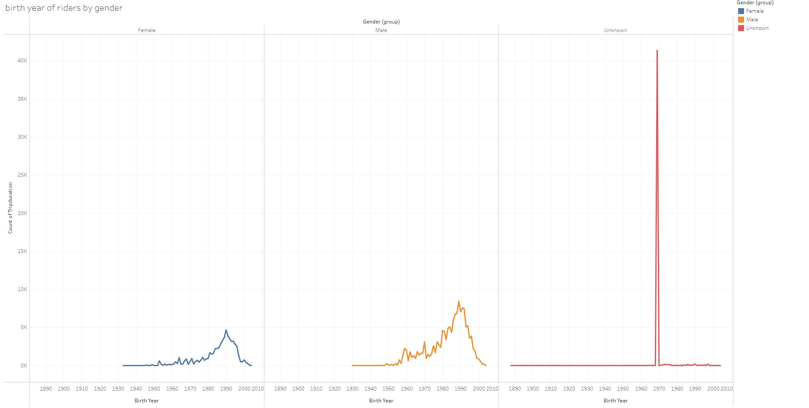

# Visualizations, Dashboards and Story
Click the link below to access the public tableau
https://public.tableau.com/app/profile/kouam.kouassi/viz/KouamKouassi/SeasonalTripdashboard?publish=yes

## Background

Congratulations on your new job! As the new lead analyst for the [New York Citi Bike](https://en.wikipedia.org/wiki/Citi_Bike) Program, you are now responsible for overseeing the largest bike-sharing program in the United States. In your new role, you will be expected to generate regular reports for city officials looking to publicize and improve the city program.

# Data
Since 2013, the Citi Bike Program has implemented a robust infrastructure for collecting data on the program's utilization. Each month, bike data is collected, organized, and made public on the [Citi Bike Data](https://www.citibikenyc.com/system-data) webpage.

For this min project, i used the Citi Bike data from June 2020 to January 2021. 

## What you can find in my Citi Bike public tableau

I created 13 visualizations, 2 dashboards and a story. With the data from Citi Bike I found some interesting fenomenon that will be displayed and analysed in this presentation.

#### Visualizations

* City Start stations Map Which map all bike stations available in the dataset.

* City End stations Map Which map all end bike stations available in the dataset.

*  Total weekly ride 

* Gender average tripduration by user in 2020 and in 2021

* Monthly Tripduration per Gender

* Gender usertype per month

* Usertype Weekly average tripduration  per Gender

* Birth year of riders by gender

* Top 20 start stations 

* Top 20 end stations

* % of total tripduration along Gender

* Best seasonal ride time

* Most used Start station per season

# Tableau page details

### This Map represents the City start stations
The stations are all located in Jersey City

### This Map represents the City end stations
In this visualization, it can be seen that the stations are distributed in Jersey City and New York

### The following view shows the year of birth by gender of those who use the services offered by Citi Bike. 

# Dashboards
### Dashboard 1 :  A dynamic dashboard that creates an interaction between the gender group, the user type and the trip duration.

1. The dashboard is made by 4 visualizations:
  * <b> The monthly trip duration per Gender </b> shows the count of trip duration made by the three gender groups ( Female, Male and Unknown), from which it is possible to notice that the male group had made more trips every month.
  * <b> Gender user type </b> represents the user type regardless of whether it is from any gender group. The Customer and the Subscriber describe the type of user. The former is a user with a 24-hour or 3-day subscription, and the latter has an annual subscription.
This visualization tells us that after a drastic decrease from June 2020 to October 2020, the unknown client has seen its average Trip duration significantly increase from the previous low of 2041 to a value of 5809 in December 2020 and then drop dramatically. The highest value of the average Tripduration for women was observed in September 2020, while male values are shallow. 
  * <b> Total weekly ride </b> represents the total number of rider in evry week from June 2020 to January 2021.
  * <b> Gender Avg trip duration by user in 2020 and 2021 </b> shows the gender riders of the two user types in 2020 and 2021. The bar graph of the customer in the year 2020 highlights the fact that the unknown and the female have almost the same average trip duration. However, The unknown has a higher average trip duration, followed by the female, while the male has the lowest value. The difference is minimal when considering the subscriber in the same year. 
In 2021, even though the male customer average trip duration is still the lowest, the female had overtaken the unknown. However, The subscriber bar graph of the same year shows that the unknown has a higher average trip duration.
In both years, however, the customer has significantly used the service offered by Citi Bike, as highlighted by the graph.

### Dashboard 2 : The Seasonal Trip dashboard is a dynamic visualization showing the interaction between the four views it is made up of.

2. The seasonal trip dashboard also has four visualizations:
  * <b> Most used station per season </b> represents the average trip duration per season( Summer, Autumn and Winter). As shown in the graph, the station Union St was most frequented in winter.
  * <b> Top 20 start stations </b> as the title describes, the view shows the rank of the 20 best start stations by taking the number of trip duration. The shape of the circle also emphasizes the ranking; the bigger it is higher the count of trip duration.
  *<b> Best seasonal ride time</b>. The line graph show the three seasons ( Summer, Autumn and winter). For this visualization, I considered how many times a station appears in the dataset, and I determined the associated time when a user decides to start a bike trip. For example, in summer and autumn, bikes were increasingly used between 5 am and 6 pm, after which we observed a drastic collapse.
  *<b> % of total tripduration along gender </b>.  In this visualization, it can be seen that the unknown customer group represent 53.16% of those who used Citi Bike bikes, followed by the two other groups with very similar percentages, 23.63% for females and 23.18% for males. Among the subscribers, on the other hand, males dominate with 70.79% of riders, followed by females with 28.05% and unknown at 1.46%.
  
 

